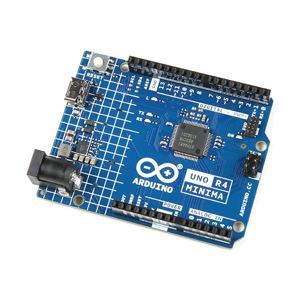

# Arduino Uno R4 MINIMA
Code snippets for Arduino Uno R4 Minima Board

<p align="center">
<picture>
  
</picture>
</p>

Results for running a counter from 0 to 10000 on Uno R3 and Uno R4 Minima:

#### Arduino Uno R3:
```
Elapsed time (s) on Uno R3: 
61.18 sec.
```

#### Arduino Uno R4 Minima:
```
Elapsed time (s) on Uno R4: 
1.36 sec.
```

### Code Examples:
- [Arduino UNO R4 Minima RTC Example](uno_r4_rtc.ino)
- Performance Test for [Arduino UNO R4 Minima](uno_r4_performance_test.ino) vs. [Arduino UNO R3](uno_r3_performance_test.ino)
- Performance Test for [Arduino UNO R4 Minima with LCD I2C Screen to show results](uno_r4_lcd_i2c_screen.ino)

Watch the implementation of this code on our [YouTube channel](https://www.youtube.com/@Roboticxps)

To get your own Arduino Uno R4 MINIMA, visit our online store: (Product Page)

* [Arduino Uno R4 Minima](https://roboticx.ps/product/arduino-uno-r4-minima/)

----

Follow us on social media:

* Facebook: https://www.facebook.com/Roboticxps
* Instagram: https://www.instagram.com/roboticx.ps
* YouTube: https://www.youtube.com/@Roboticxps
* LinkedIn: https://www.linkedin.com/company/roboticx
